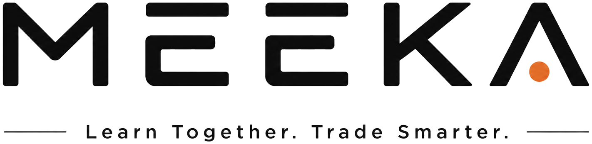

# MEEKA · AI 外贸人的共同成长社区

> Learn Together. Trade Smarter. —— 一起学习，更聪明地做外贸。

MEEKA（米卡，源自 meerkat 狐獴）是面向外贸人的 AI 成长社区：知乎式信息流 + 成长任务 + 资源市场 + 资源对接 + AI 工作流实验室。本仓库为 Web 前端（Next.js 15 · App Router）。



## 技术栈

- Next.js 15（App Router · RSC）+ TypeScript
- TailwindCSS v4（暖纸张设计系统：`#F8F8F6` 底 / `#121212` 主字 / `#D97757` 强调）
- lucide-react 图标
- IP 角色系统：`<Meeka state="wave" size={64} />`（自动 2x Retina 源图，见 `components/meeka/`）

## 快速开始

```bash
npm install
npm run dev      # http://localhost:3000
npm run build    # 生产构建
```

## 页面结构（第一阶段）

| 路由 | 说明 |
|------|------|
| `/` | 知乎式信息流：发布入口 + 推荐 Feed + 右栏（新人导航/大家都在找/资源对接/继续学习/近期活动） |
| `/login` `/register` | 登录 / 注册（IP 场景图） |
| `/onboarding` | 六步新人引导（身份→平台→行业→目标→介绍→路径） |
| `/growth` `/resources` `/community/*` `/lab` `/workspace` | 成长 / 资源市场 / 社区（Feed·问答·资源对接·组队）/ 实验室 / 工作台 |
| `/creator` `/admin` | 创作者中心 / 管理后台（占位） |
| 404 | `app/not-found.tsx`（IP 场景图） |

## 目录约定

```
app/                 # App Router 页面
components/
  app-shell/         # 顶部导航 + 侧栏 + 个人中心菜单
  meeka/             # IP 标准组件
  feed/ community/ resources/ growth/ ui/
types/               # 全部数据 interface（user/feed/resource/onboarding…）
public/assets/
  meeka/             # IP 角色 PNG（真透明，64/128/256/512 四档）
  logo/              # 品牌 Logo（主标/反白/导航版）
docs/                # 产品与设计文档
```

## 部署

见 [DEPLOY.md](./DEPLOY.md)：GitHub → Vercel（托管构建）→ Cloudflare（DNS/CDN）。

## 快速搬品 MVP

访问 `/product-copy`，粘贴你有权使用的公开商品链接，可提取页面元数据并编辑标题、描述、关键词和类目 ID，再保存到浏览器本机草稿箱。当前版本不会自动复制受保护素材，也不会自动上架；阿里国际站草稿提交需要下一阶段接入类目 Schema、图片中心上传和发布接口。

集合页批量采集：先在 `/product-copy/pair` 配对 Chrome 扩展 `extensions/alibaba-product-collector`，再打开 Alibaba 店铺产品集合页，扩展会自动滚动并尝试连续采集最多 20 页，完成后可同步到 MEEKA 后台。首次部署还需在 Supabase SQL Editor 执行 `supabase/migrations/202608300001_product_copy.sql`。

## 品牌与素材版权

MEEKA 品牌名称、Logo 与米卡（Meeka）IP 形象为项目自有资产，未经授权请勿商用。

---

主理人：常征 Sean · © 2026 MEEKA
